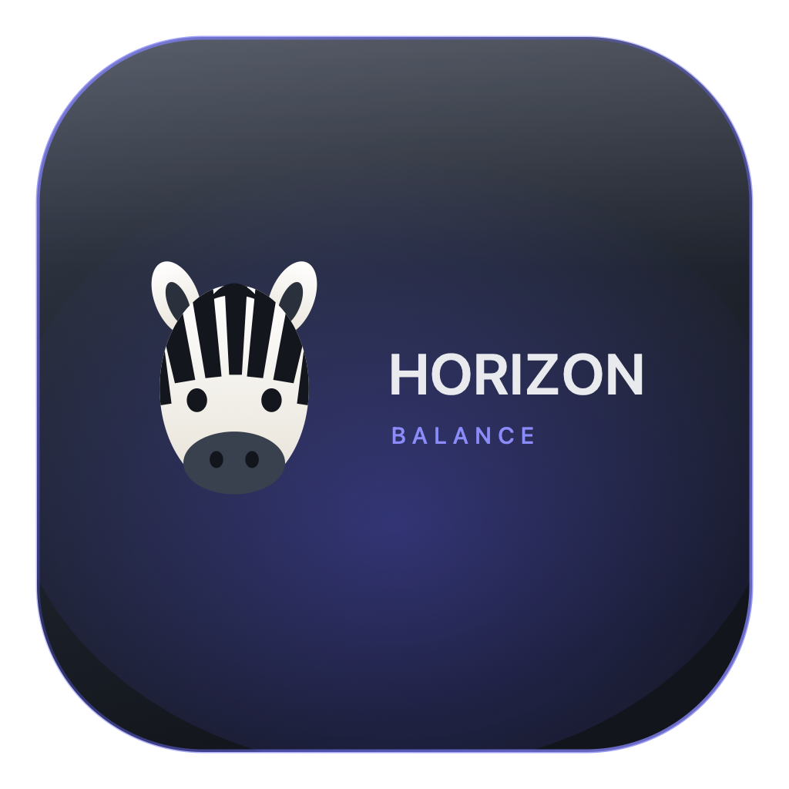
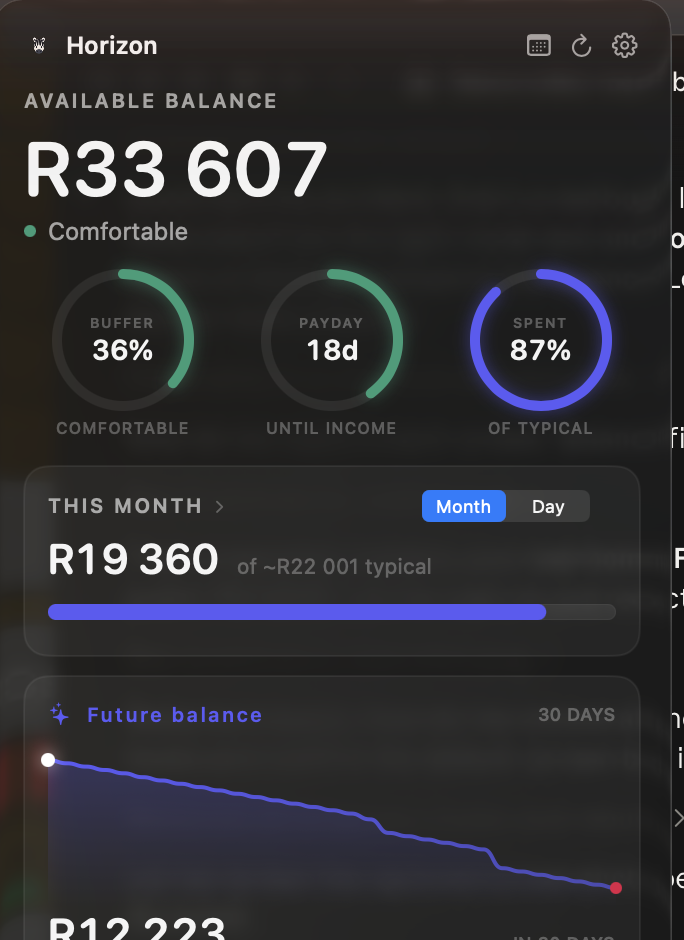
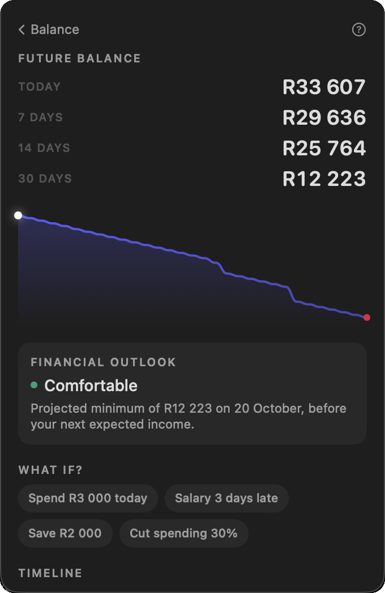
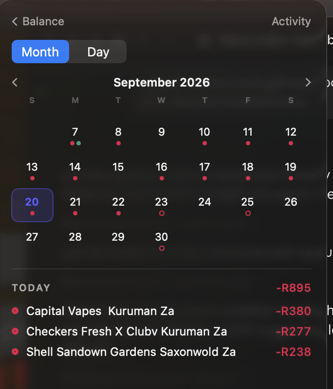
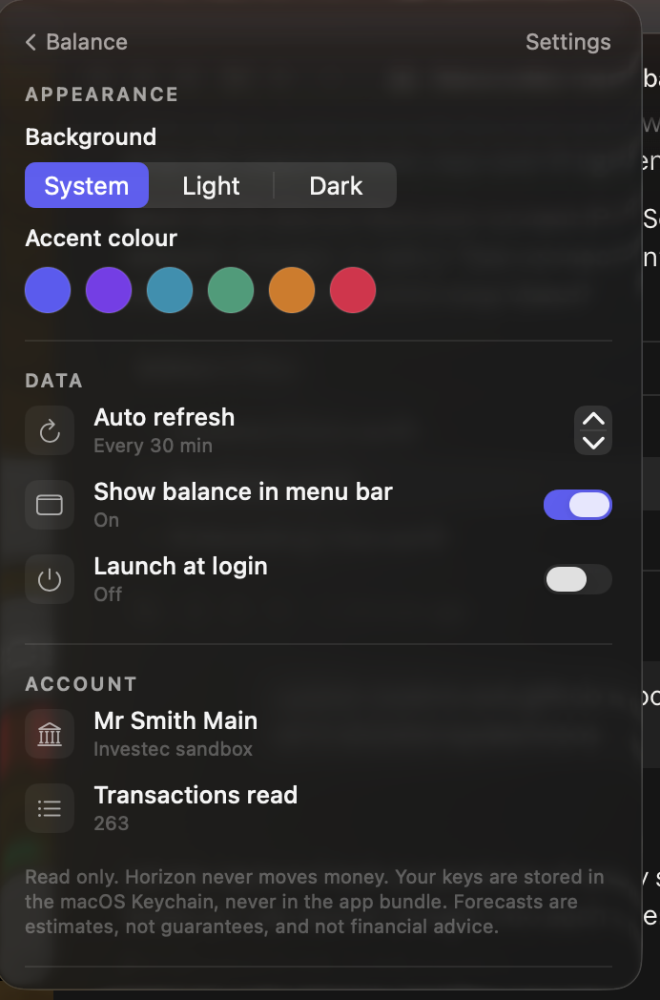
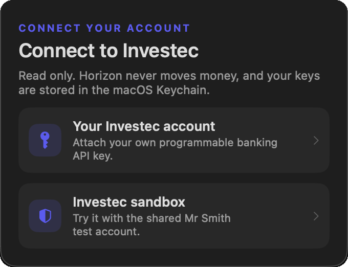
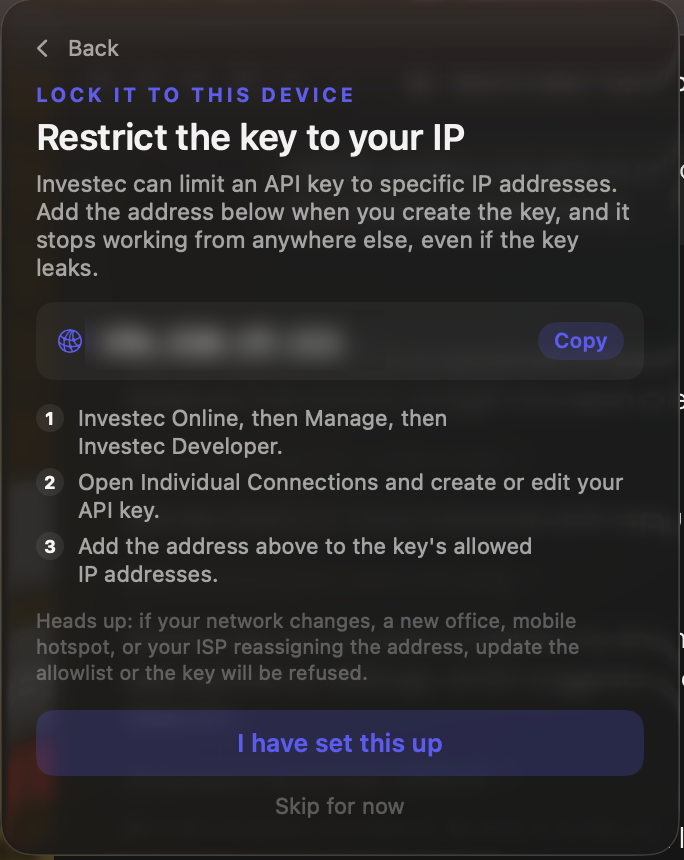

<div align="center">



# Horizon

### Your balance, and what it is about to do next.

A native macOS menu bar app that reads your Investec account and forecasts where your
balance is heading, with the reasoning shown.

<br />


**[Download](https://github.com/Nevvyboi/Horizon/releases/latest) · [Report an issue](https://github.com/Nevvyboi/Horizon/issues)**

</div>

<br />

> Most banking apps tell you what already happened. Horizon tells you what happens next.
> One glance, about two seconds: **current balance, future balance, and what caused the change.**

Horizon lives in the menu bar as a zebra and your live balance. Click it and the whole
product is one popover. Every screenshot below is the real app running against a live
Investec account.

<br />

---

## The balance, at a glance

<table>
<tr>
<td width="47%"></td>
<td valign="top">

**The number you actually came for** sits at the top, with a one word read on it:
comfortable, getting tight, or low buffer. That word is not decoration, it comes from your
projected **minimum** balance compared to your monthly commitments.

The three rings are the whole month compressed:

- **Buffer** is how much of today's balance survives to the lowest point of the forecast.
  36% means the dip takes roughly two thirds of it.
- **Payday** counts down to the next income Horizon detected, and fills as the pay cycle
  progresses.
- **Spent** is this month against what a normal month looks like for you. It turns red
  past 90%, which is the useful moment to know.

**This month** switches between the month total and a per day average, so "R19 360 spent"
becomes "R968 a day versus a typical R579". The daily view is usually the one that
explains the month.

Below it, the forecast curve and where it lands in 30 days.

</td>
</tr>
</table>

<br />

## Where the balance is heading

<table>
<tr>
<td valign="top">

The ladder is the forecast in four numbers. Today, a week out, a fortnight, a month. If it
only tells you one thing, it is whether the line goes up or down.

**Financial outlook** names the lowest point and the date it happens, because a month end
balance can look healthy while the third week quietly goes to nothing. The projected
minimum is the number that actually decides whether a purchase is safe.

**What if?** re runs the whole forecast with one thing changed and redraws the curve, with
the original left behind as a dashed ghost line so you can see the difference rather than
being told it. Spending R3 000 today, a salary landing three days late, cutting back 30%.

The comparison tracks the projected **minimum**, not the end balance. A late salary leaves
the 30 day endpoint identical while making the dip much worse, so comparing endpoints
would tell you it costs nothing, which is wrong.

The question mark opens the full arithmetic behind the number.

</td>
<td width="47%"></td>
</tr>
</table>

<br />

## Every day that moves money

<table>
<tr>
<td width="47%"></td>
<td valign="top">

A month at a time, with a dot on every day something happens.

- **Red** is money out, **green** is money in.
- **Filled** dots already happened. **Hollow** dots are forecast, so the future half of the
  month is visibly a prediction rather than a fact.
- Today is ringed in your accent colour.

Click any day and it opens below with the total and each line item. The **Day** tab steps
through one day at a time for the same detail without the grid.

This is the view that answers "why was last week so expensive" faster than a list of
transactions ever does.

</td>
</tr>
</table>

<br />

## Make it yours

<table>
<tr>
<td valign="top">

**Background** follows the system, or you can pin it to light or dark.

**Accent colour** has six options. This is applied to the whole interface, including the
forecast curve and the gauges.

**Auto refresh** picks how often Horizon pulls from Investec, from 5 to 60 minutes. There
is also a refresh button in the header for right now.

**Account** shows which account is connected, whether it is your own or the shared
sandbox, and how many transactions the forecast was built from.

Disconnecting wipes the credentials out of the Keychain and returns the app to onboarding.

</td>
<td width="47%"></td>
</tr>
</table>

<br />

## Connecting, and locking it down

<table>
<tr>
<td width="47%"><br /><br /></td>
<td valign="top">

Two ways in: the **shared Investec sandbox** to try it in one click, or **your own account**
with keys from Investec Online, then Manage, then Investec Developer.

There is no production or sandbox switch to get wrong. Your keys are treated as production,
and if Investec rejects them there Horizon retries the sandbox host automatically.

**Restrict the key to your IP** is the step worth doing. Investec can limit an API key to
specific addresses, so a leaked key is useless from anywhere else. Horizon looks up the
public address this Mac appears as, gives you a copy button, and walks through where the
setting lives. It also warns you about the catch: a changing address, a hotspot or a VPN
will lock you out until the allowlist is updated.

When a connection fails, Horizon explains it instead of showing a status code. A 403 leads
with the allowlist as the likely cause and offers your IP right there in the error.

</td>
</tr>
</table>

<br />

---

## How the forecast works

No black box. Every figure traces back to a step in
[`ForecastEngine.swift`](Sources/Horizon/ForecastEngine.swift):

1. Start from the current **available balance**.
2. **Find recurring payments and income.** A merchant only counts once it has fired three
   or more times on a steady interval (5 to 45 days). Regularity is scored, so a debit
   order sails through while noisy card spending at the same shop fails the test and is
   ignored. Without this, buying coffee often makes coffee a "subscription".
3. **Estimate everyday spending** as the average non recurring outflow over 60 days.
4. Lay the recurring events onto a **calendar** across the next 30 days.
5. Add the estimated daily spend on top.
6. Walk **day by day** to get a projected balance for every day.
7. Find the **lowest point**, the number that actually matters.
8. Surface the **assumptions** and any risks.

Scenarios re run the same pipeline with the event list nudged, so a scenario is always
explainable in the same terms as the base forecast.

<details>
<summary><b>Which Investec data it uses</b></summary>

<br />

Investec Private Banking API, read only:

- `GET /za/pb/v1/accounts`
- `GET /za/pb/v1/accounts/{id}/balance`
- `GET /za/pb/v1/accounts/{id}/transactions`

OAuth2 client credentials (Basic auth plus `x-api-key`, `scope=accounts`). Sandbox serves
the token and the data from `openapisandbox.investec.com`; production serves both from
`openapi.investec.com`. Mixing the two is the classic way to get an auth failure that looks
like an empty account.

Horizon never calls a payment or transfer endpoint. Being native, it talks to Investec
directly, so there is no proxy and no browser in the path.

</details>

<details>
<summary><b>What it assumes, and where it can be wrong</b></summary>

<br />

- Recurring payments continue at their detected amount and cadence.
- Everyday spending resembles the last 60 days on average.
- The next salary lands on its detected cadence. Horizon predicts by interval rather than
  by calendar day, so a payday can drift a day or two.
- One account is forecast at a time.

Forecasts are projections, not guarantees. The interface says projected and expected, never
"you will have".

</details>

<br />

## Security

- **Keys live in the macOS Keychain.** Never in the app bundle, never on disk in the clear,
  never in this repo.
- **Read only.** Horizon has no code path that moves money.
- **IP allowlisting** is offered during setup so the key only works from your device.
- The only request to anything other than Investec is the public IP lookup on the allowlist
  screen, which sends no account data.

<br />

## Build it yourself

Requires macOS 14 or later and the Swift toolchain (Xcode or the Command Line Tools).

```bash
git clone https://github.com/Nevvyboi/Horizon.git
cd Horizon
./scripts/bundle.sh
open build/Horizon.app
```

`scripts/bundle.sh` builds a release binary with Swift Package Manager and wraps it in a
proper `.app`. It is an agent app, so it lives only in the menu bar with no Dock icon and
no entry in the app switcher.

Note that the build is ad hoc signed. macOS ties Keychain access to the code signature, so
each rebuild will ask for Keychain permission again. A real signing identity removes that.

<br />

## How it is put together

```
Sources/Horizon/
  HorizonApp.swift      MenuBarExtra entry point
  AppState.swift        loading, refreshing, scenario building, error reporting
  InvestecClient.swift  OAuth2 and the read only endpoints
  ForecastEngine.swift  recurring detection and the projection
  Keychain.swift        credential storage
  PublicIP.swift        the address to allowlist
  Models.swift          the shared shapes
  Theme.swift           accent themes and appearance
  ZebraMark.swift       the mark
  RootView / FutureView / ActivityView / SettingsView / OnboardingView
```

<br />

## What it will not do

- Move money. No payments, transfers or trades. Read only, always.
- Give financial advice. Scenarios are calculations, not recommendations.
- Store your credentials anywhere but the Keychain.
- Pretend a projection is a promise.

<br />

## Licence

MIT. See [LICENSE](LICENSE).
